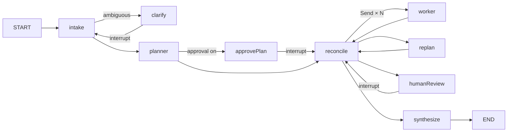

# Analytax

**An adaptive multi-agent task orchestrator on LangGraph.js, powered by Google Gemini, with a live React showcase and OpenTelemetry tracing.**

A client submits a query. The orchestrator:

1. **Works out the intent.** It decides between a *direct* answer and a *plan*, and asks clarifying questions only when it has to.
2. **Breaks the query into a DAG of tasks.** Each task is sized for one pre-defined agent (persona, job prompt, tools, folder-loaded skills, Gemini tier).
3. **Runs independent tasks in parallel.** It evaluates every result and passes task-scoped context downstream.
4. **Adapts when reality diverges.** When agents find missing prerequisites, propose follow-ups, fail repeatedly or deadlock, it changes the plan through validated patch operations instead of index/cursor surgery.
5. **Returns a clear, precise final answer,** with honest limitations when parts couldn't be completed.

Every step publishes **lifecycle events**. Pure **projections** turn them into the task board, DAG, timeline, agent activity and metrics that the React UI renders live.

---

## Why a task ledger, not a task loop

In a loop over `tasks[i]`, "insert a task before the next one" means mutating the array and the cursor. That breaks under parallelism, retries, checkpoints and human interrupts. Analytax replaces the loop with:

- **A mutable DAG (task ledger)** in graph state.
  - A task runs when it is `submitted` and every dependency is `completed`. There are no positions or cursors.
  - "Insert X before T" is simply `add_task X` + `add_dependency(T → X)`.
- **Validated plan operations** are the only way to change the plan: `add_task`, `update_task`, `cancel_task`, `add/remove_dependency`, `split_task`, `revise_task`, `retry_task`.
  - `applyPlanOps` is a pure function. It checks agents and capabilities, dangling references, cycles (Kahn), caps, spawn depth and fingerprint deduplication.
  - Every change bumps the plan version and emits a `plan.patched` diff.
- **Single writer.** Parallel workers only write their report to an `inbox`. The deterministic `reconcile` node is the only writer of the ledger:
  - Agents *propose* (structured outcomes).
  - The evaluator *judges* (rules, then an LLM judge).
  - The policy *decides*.
  - An LLM replanner runs only for what the policy can't resolve.



| Unknown situation mid-run | What happens |
|---|---|
| An agent can't finish without missing work | Outcome `blocked` + a `prerequisite` proposal → a prerequisite task is inserted and the blocked task depends on it; the task re-runs with its partial output (not counted as an attempt) |
| Missing work is discovered *after* a task was accepted | Prerequisite task + `revise_task` → a revision replaces the original for dependents |
| Follow-up / post-task work | `follow_up` proposals from accepted outcomes are auto-accepted (deduplicated, capped, depth-limited); the proposer's pending dependents wait for them. The critic's follow-ups become revisions of the reviewed task |
| A task is rejected | Recovery ladder: retry with feedback → escalate tier → reassign to another capable agent → replan → human review → fail with a degraded result |
| Error loops | Error-signature and output fingerprints jump the ladder; intra-task tool-call loops are cut off by middleware |
| An upstream task fails | Cascade: `best_effort` dependents drop the input; the critical path asks the replanner once; others are canceled. Failed revisions fall back to the original |
| Deadlock, stall, plan explosion, budget/deadline | Replan with a diagnosis; a progress ledger forces a replan after N waves without progress; a growth guard freezes auto-spawning; stopping always ends in a **partial synthesis**, never a recursion error |

---

## Repository layout

```
agents/*.agent.md            Agent cards: YAML frontmatter (persona, capabilities, tools, skills, model tiers, limits) + job prompt
skills/<name>/SKILL.md       Agent Skills (agentskills.io format) with optional references/ and assets/
config/models.yaml           Gemini tiers (model + thinking), role → tier, pricing
config/orchestrator.yaml     Guards, limits, HITL defaults, evaluation and artifact settings
config/mcp.yaml              MCP tool servers (optional): URLs, auth headers from env, per-server limits and toggles
data/payroll/*.sql           Synthetic payroll demo database: schema, seed, views (loaded with `pnpm payroll:load`)
packages/contracts           Shared zod contracts: tasks, plan ops, outcomes, verdicts, lifecycle events, interrupts + projections
apps/orchestrator            LangGraph graph, control kernel, agents runtime, skills, tools, telemetry, tests (langgraph.json lives here)
apps/web                     Vite + React showcase built on the LangGraph React SDK
docker-compose.yml           grafana/otel-lgtm (Grafana, Tempo, Prometheus, Loki) for local telemetry
```

Key orchestrator modules:

| Area | Files |
|---|---|
| Plan kernel (pure) | `src/planning/apply-plan-ops.ts`, `cascade.ts`, `dag.ts`, `readiness.ts`, `fingerprint.ts` |
| Control kernel (pure) | `src/control/reconcile.ts`, `policy.ts`, `proposals.ts`, `context-packet.ts`, `gaps.ts`, `tier.ts` |
| Graph | `src/graph/state.ts`, `build.ts`, `routing.ts`, `nodes/*` |
| Agents | `src/agents/registry.ts` (cards), `runtime.ts` (`createAgent` + middleware), `prompt.ts`, `middleware.ts` |
| Skills | `src/skills/registry.ts` (discovery/validation), `middleware.ts` (`activate_skill`, `read_skill_resource`) |
| MCP | `src/mcp/hub.ts` (connections, backoff, per-run tools), `connection.ts`, `schema.ts` (Gemini-safe schemas), `config.ts`, `tool.ts` |
| Models | `src/models/factory.ts` (`ChatGoogle` per tier), `capabilities.ts` (thinking-config validation), `structured.ts` |
| Telemetry | `src/telemetry/instrument.ts`, `tracing.ts`, `genai-handler.ts`, `metrics.ts` |

---

## Quick start

**Prerequisites:**
- Node.js **22+**
- pnpm **10+**
- A Gemini API key (<https://aistudio.google.com/apikey>)
- Docker (optional, for telemetry)

```bash
pnpm install
cp .env.example .env            # then set GOOGLE_API_KEY
pnpm validate:config            # config, agent cards, skills, tier/thinking combinations
pnpm test                       # unit + property + scenario tests (no API key needed)
pnpm smoke:models               # live check of every tier: structured output + tool loop (uses your key)

pnpm otel:up                    # optional: Grafana LGTM on http://localhost:3000 (admin/admin) + ANALYTAX_TELEMETRY_EXPORTER=otlp
                                # (default: telemetry goes to JSON-lines files in logs/telemetry/)
pnpm dev                        # Agent Server on :2024 + React UI on :5173
```

**No API key yet?** Set `ANALYTAX_OFFLINE_MODELS=true` (and optionally `ANALYTAX_ENABLE_FAULTS=true`) in `.env`. Deterministic stand-in models then drive the whole flow: planning, parallel waves, evaluation, interrupts, demo faults and the UI, all without calling Gemini. With the server running, `pnpm --filter @analytax/orchestrator e2e:server [--faults]` checks the whole server path over HTTP: interrupt → resume → final state, durable and live events, and stored artifacts.

**A database to ask questions about.** `data/payroll` builds a synthetic payroll database (about 775k rows across 25 tables, five views and a monthly-partitioned fact table) on any PostgreSQL server reachable through an MCP server. Point `local-postgres` in `config/mcp.yaml` at yours and run `pnpm payroll:load --drop --verify`. The `db-analyst` agent is written against that schema, and `data/payroll/evals.md` holds nine questions with measured answers for checking how well it does.

| URL | What |
|---|---|
| **UI** | <http://localhost:5173> |
| **Agent Server API** | <http://localhost:2024> (graph id `orchestrator`, catalog at `/analytax/catalog`) |
| **LangGraph Studio** | <https://smith.langchain.com/studio/?baseUrl=http://127.0.0.1:2024> |
| **Grafana** | <http://localhost:3000> → Explore → Tempo (traces) / Prometheus (metrics) |

### Starting a run from code

```ts
import { Client } from "@langchain/langgraph-sdk";

const client = new Client({ apiUrl: "http://localhost:2024" });
const thread = await client.threads.create();
for await (const chunk of client.runs.stream(thread.thread_id, "orchestrator", {
  input: {
    messages: [{ type: "human", content: "Compare Qdrant, Milvus and pgvector for a 50M-embedding RAG workload and recommend one." }],
    runOptions: { hitl: { approvePlan: false }, maxConcurrency: 4 },
  },
  streamMode: ["values", "custom"],
  config: { recursion_limit: 160 },
})) {
  if (chunk.event === "custom") console.log(chunk.data); // { channel: "analytax", event: LifecycleEvent }
}
```

---

## Models

Tiers are configured in `config/models.yaml` and validated against a thinking-capability matrix at startup, so invalid combinations fail fast instead of returning HTTP 400.

| Tier | Intended use | Default |
|---|---|---|
| `deep` | complex reasoning, planner, replanner | `gemini-3.1-pro-preview` · thinking `high` |
| `standard` | research / moderate tasks ("Pro, low thinking") | `gemini-3.1-pro-preview` · thinking `low` (lowest Pro setting) |
| `fast` | small / general questions, intake | `gemini-3.6-flash` · thinking `minimal` (near off) |
| `fast-thinking` | small tasks with a thinking budget, judge | `gemini-3.8-flash` · thinking `medium` |

> **No current Gemini Pro model can turn thinking off.** 3.1 Pro's minimum level is `low`; 2.5 Pro's minimum budget is 128. `standard` therefore uses Pro at `low`, which still reasons briefly on harder prompts. Gemini 3.x `minimal` is "near off", not off. The only true "no thinking" option is `gemini-2.5-flash` with `budget: 0` (configured as `fast`'s alternate). A `budget` on a Gemini 3.x model is rejected at startup because LangChain would silently map it to a level. Temperature is deprecated for Gemini 3.x and intentionally not configurable.
>
> **Thought signatures:** Gemini 3.x requires each tool call's `thoughtSignature` to be sent back on the next turn. `@langchain/google` 0.2.5 drops it on the stream-events path that the Agent Server uses for runs started from the web UI, so the model factory sets `disableStreaming: true` (plain `generateContent`). `pnpm smoke:models --stream-v3` exercises that path live.

**How a task's tier is chosen:**
- The agent card's `defaultTier` is shifted by task complexity (low −1, high +1) and clamped to the card's `minTier…maxTier`.
- Escalation walks `fast → fast-thinking → standard → deep`.
- Set `useAlternates: true` to switch every tier to its alternate model (e.g. when preview quota runs out).

---

## Extending

### Add an agent

Create `agents/<id>.agent.md`:

```md
---
id: data-engineer
name: Data Engineer
description: Designs data pipelines and schemas.
persona: Pragmatic engineer who favors simple, observable systems.
capabilities: [data_modeling, pipeline_design]
tools: [web_search, calculator]
skills: [structured-analysis]
model: { defaultTier: standard, minTier: fast-thinking, maxTier: deep }
limits: { modelCalls: 10, toolCalls: 15, timeoutMs: 180000 }
evaluation: auto          # auto | always | never
---
## Job
What this agent is responsible for, how it works, what its output must contain, and when to propose prerequisites or follow-ups.
```

The planner sees each agent's capabilities, tools and skills and assigns tasks by capability. Unknown tools or skills fail at startup.

### Add a skill

Create `skills/<name>/SKILL.md` following the [Agent Skills spec](https://agentskills.io/specification). Frontmatter must include `name` (matching the directory) and `description`, and may include `license`, `compatibility`, `metadata`, `allowed-tools`. Add `references/` and `assets/` as needed.

Skills load with progressive disclosure:
1. The agent's system prompt lists only `name`, `description` and location.
2. The agent calls `activate_skill` to load the instructions.
3. It calls `read_skill_resource` for bundled files (read-only, path-safe, allow-listed).

Skill `scripts/` are **not executed**; running them needs a sandboxed runner.

### Add a tool

Implement a LangChain `tool()` in `apps/orchestrator/src/tools/`, register it in `src/graph/deps.ts`, and reference it by name from agent cards.

### Add MCP tool servers

Agents can use tools from remote [MCP](https://modelcontextprotocol.io) servers. Analytax connects over Streamable HTTP and falls back to SSE for older servers.

**Local servers work too, as a localhost URL.** Analytax never starts, supervises or restarts server processes: you run them yourself. `pnpm mcp:example` runs a small example server with `echo` and `current_time` tools.

1. **Configure the server** in `config/mcp.yaml`:
   ```yaml
   servers:
     docs:
       title: Internal docs
       url: https://docs.example.com/mcp
       headers: { Authorization: "Bearer ${DOCS_MCP_TOKEN}" }   # ${VAR} and ${VAR:-default} from .env
       tools: { include: [search, read_page] }                   # optional allow and deny lists
   ```
2. **Give tools to agents** in their cards. Use `mcp:docs/search` for one tool, or `mcp:docs/*` for every tool the server allows. Agents only get the MCP tools their card lists.
3. **Check connectivity** with `pnpm mcp:check`. It connects and lists tools as agents will see them, and calls no model.

**A worked example: a database agent.** `config/mcp.yaml` ships a `local-postgres` server and `agents/db-analyst.agent.md` uses six of its tools to answer payroll questions in SQL. Writes are refused by the guard below, so the demo database is loaded by a separate script:

```bash
pnpm payroll:load --drop --verify   # schema, ~775k generated rows, views; ~45 s
pnpm payroll:load --dry-run         # what it would run, without sending anything
```

The loader talks to the MCP server directly rather than through the hub, which is the only supported way to write: agents never can.

**Turning servers on and off:**

| Scope | How |
|---|---|
| All MCP | `enabled: false` in `config/mcp.yaml`, or `ANALYTAX_MCP_ENABLED=false` |
| One server | `enabled: false` on that server |
| One run | UI: Run settings, then Tool servers. HTTP API or LangGraph Studio: run context `{"mcp": {"disabled": ["docs"]}}`, or `{"mcp": {"enabled": false}}` to turn all off |

Offline demo mode turns MCP off.

**How it behaves:**

- **Connections:** open on first use and are warmed up in the background when the server starts.
- **Failures:** a failed server is retried only when a run needs it again. The wait grows from 5 s up to 5 min, with no polling.
- **Run snapshot:** each run records which servers were usable at the start. The planner only sees tools that are actually available, and an agent whose server is down is told so and works without it.
- **Limits per server:** calls time out (`timeoutMs`), are limited in concurrency (`maxConcurrentCalls`) and are truncated (`maxOutputChars`).
- **Expired sessions:** a session the server forgot is re-established once, and the call is retried.

The Agents page shows each server's status, tools, last error and which agents use it, with a button to connect now.

**Security:**

- **Secrets:** header values and interpolated values never appear in logs, telemetry, events or the UI.
- **Tool output:** it reaches the agent framed as untrusted data, and agents are told never to follow instructions inside it.
- **Tool descriptions:** they also come from the server, so they are capped and prefixed with the server's title.
- **Tool schemas:** they are rewritten into the JSON Schema subset Gemini accepts. A tool that can't be rewritten is skipped and listed on the Agents page.

**Guarding tool arguments:** a tool that takes SQL, or any other instruction, can be constrained before the call leaves Analytax:

```yaml
    guards:
      execute_sql:
        sql: read-only-sql
```

The `read-only-sql` policy (`src/mcp/sql-guard.ts`) lexes the statement and allows a single `SELECT`, `WITH`, `EXPLAIN`, `SHOW`, `TABLE` or `VALUES`. It refuses writes and DDL, a second statement smuggled after a semicolon, `EXPLAIN ANALYZE`, `SELECT … INTO`, row locking, session changes, and file or network functions, and it is not fooled by keywords inside string literals or "quoted identifiers". A refused call never reaches the server, shows in the UI as a failed tool call, and leaves the connection healthy.

It is a lexer, not a parser: it refuses on ambiguity (an unquoted column named `set` is rejected) and it cannot see a write hidden inside a volatile function. Treat it as defence in depth and still point the server at a read-only database role. Guards are opt-in per server, and a guard naming a tool or argument the server does not offer is reported on the Agents page and by `pnpm mcp:check`.

---

## Human in the loop and demo faults

Per-run options are sent in the input (`runOptions`) and clamped to `config/orchestrator.yaml → limits`:

- **`hitl.clarify`** (default on): ask the client up to 3 questions when the query is genuinely ambiguous.
- **`hitl.approvePlan`**: pause after planning. The reviewer can approve, edit (plan ops) or reject with feedback (triggers re-planning).
- **`hitl.humanReview`**: when a critical task exhausts the ladder or an agent needs client-only input, pause for a decision (retry / skip / answer / abort).

Set `ANALYTAX_ENABLE_FAULTS=true` to let the UI inject **demo faults**, so every adaptive path can be shown reliably:
- `block_with_prerequisite`
- `reject`
- `transient_error`
- `propose_follow_up`
- `decline`

---

## Lifecycle events and projections

- **Durable events** are written by control nodes into graph state (`values.events`), ordered by a thread-wide `seq`. They survive reloads, thread history and interrupts. Examples: `plan.patched`, `task.escalated`, `guard.tripped`, `run.completed`.
- **Ephemeral events** are streamed live from inside running agents on the LangGraph **custom** stream (`{ channel: "analytax", event }`). Examples: `agent.tool.started`, `agent.skill.loaded`, `agent.thought`, `heartbeat`.
- **Projections** (`packages/contracts/src/projections`) are pure `(view, event) → view` reducers shared by the UI and tests:
  - `taskBoard`
  - `dag` (+ `selectDagGraph`)
  - `timeline`
  - `agentActivity`
  - `metrics`
  - `ledger`

  `foldEvents(events, defaultProjections)` dedupes and orders any mix of durable and ephemeral events.

---

## Telemetry

OpenTelemetry starts with the graph module. `ANALYTAX_TELEMETRY_EXPORTER` picks where it goes:

| Value | Destination |
|---|---|
| `file` (default) | JSON lines in `logs/telemetry/`: `traces-YYYY-MM-DD.jsonl` (one span per line, with `traceId`/`parentSpanId`) and `metrics-YYYY-MM-DD.jsonl` (delta metrics every 15 s). No Docker needed; override the folder with `ANALYTAX_TELEMETRY_DIR`. |
| `otlp` | OTLP/proto to `OTEL_EXPORTER_OTLP_ENDPOINT`, e.g. Grafana LGTM from `pnpm otel:up`. |
| `none` | Telemetry off (same as `ANALYTAX_TELEMETRY_ENABLED=false`). |

Handy queries on the file logs: `grep '"name":"invoke_agent' logs/telemetry/traces-*.jsonl`, or filter one run with `grep <traceId>`.

**Traces:** one trace per run, even across interrupts and processes. The root `invoke_workflow analytax` span's `traceparent` is stored in state, and every node span parents to it.

```
invoke_workflow analytax
├─ orchestrator.intake → chat {model}
├─ plan orchestrator → chat {model}
├─ orchestrator.reconcile            (span events: plan patches, guard trips)
├─ invoke_agent researcher           (task, attempt, tier, dispatch)
│  ├─ chat gemini-3.1-pro-preview    (gen_ai.usage.input/output/reasoning tokens)
│  └─ execute_tool web_search
├─ orchestrator.replan
└─ orchestrator.synthesize
```

**Metrics:**
- GenAI: `gen_ai.client.token.usage`, `gen_ai.client.operation.duration`, `gen_ai.invoke_agent.duration`, `gen_ai.execute_tool.duration`.
- Orchestration: `analytax.task.outcomes`, `analytax.task.attempts`, `analytax.plan.patches`, `analytax.guard.trips`, `analytax.wave.duration`, `analytax.run.duration`, `analytax.run.cost_usd`.

Prompt/response content is recorded only when `OTEL_INSTRUMENTATION_GENAI_CAPTURE_MESSAGE_CONTENT=true`.

---

## Testing

| Suite | Command | What it proves |
|---|---|---|
| Plan kernel | `pnpm test` | Plan-op semantics (insert, split, revise, retry), and a fast-check **property**: random op sequences never create cycles or dangling dependencies |
| Cascade and policy | `pnpm test` | Failure propagation rules, and every row of the recovery ladder |
| Projections | `pnpm test` | Event ordering/dedupe and each view |
| Agent runtime | `pnpm test` | `createAgent` + skills + tools + UI events + structured outcome, using a scripted chat model |
| Scenarios | `pnpm test` | End-to-end graph runs with scripted models: parallel fan-out and determinism, mid-task prerequisites, sibling follow-up dedupe, escalation → replan split, guard trip → partial answer, plan-approval interrupt and resume, critical-path rescue, crash recovery without duplicate events |
| MCP | `pnpm test` | Config and `${VAR}` interpolation, Gemini-safe tool names and schemas, and the hub against an in-process MCP server: SSE fallback, auth headers, backoff, session-expiry retry, timeouts, concurrency limits and per-run switches |
| Live models | `pnpm smoke:models [--tier fast] [--search]` | Every tier accepts its thinking config, runs a tool loop (thought signatures) and returns a valid structured outcome |
| MCP servers | `pnpm mcp:check` | Every configured MCP server connects and lists its tools (no model calls) |
| Payroll demo data | `pnpm payroll:load --drop --verify` | The demo schema, seed and views load from scratch, and row counts per table are printed |

---

## Production notes

- **Serving:** `langgraph dev` is an in-memory development server. For production, deploy the Agent Server via LangSmith Deployment; a self-hosted standalone Agent Server requires an Enterprise license. The graph is server-agnostic (`compileOrchestrator(deps, { checkpointer, store })`), so a self-hosted Hono/Express server with `PostgresSaver` is a straightforward adapter.
- **Artifacts:** large task outputs live in the LangGraph store (`["analytax", threadId, "artifacts"]`); state keeps summaries plus references.
- **Scope (v1):**
  - one query per thread (no follow-up turns on a finished thread);
  - skill scripts are not executed;
  - MCP servers over HTTP only (no stdio, no OAuth sign-in);
  - no auth/multi-tenancy.
